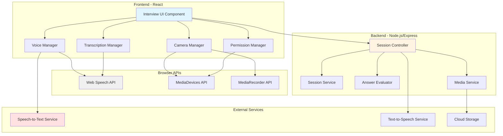
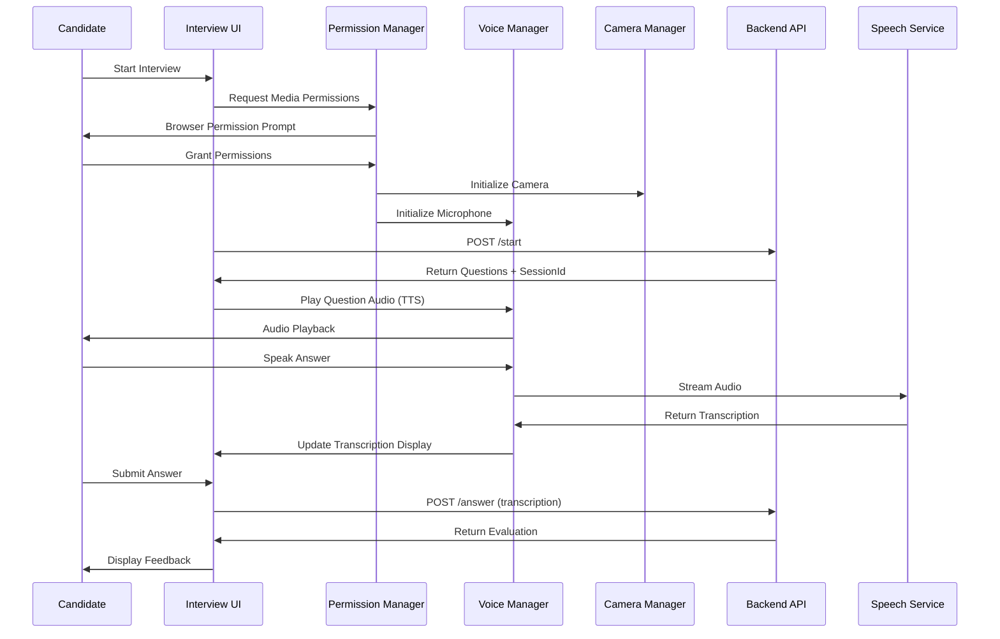

# Design Document: AI Voice and Video Interview Enhancement

## Overview

This design extends the existing text-based live interview system with multimodal interaction capabilities, enabling candidates to participate using voice responses and video presence. The enhancement maintains backward compatibility while adding real-time speech-to-text transcription, text-to-speech question delivery, camera video capture, and optional session recording.

The design follows a layered architecture approach:

- **Backend Layer**: Extended session management, media metadata storage, and integration with speech services
- **Frontend Layer**: New media components for voice/video capture, real-time transcription UI, and mode switching
- **Integration Layer**: Adapters for speech services (Web Speech API or cloud providers) and media device APIs

Key design principles:

- Progressive enhancement: Text mode remains fully functional
- Graceful degradation: System falls back to text mode on media failures
- Privacy-first: Minimal data retention, explicit consent for recording
- Performance-conscious: Optimized for real-time interaction with acceptable latency

## Architecture

### System Architecture Diagram



### Component Interaction Flow



## Components and Interfaces

### Backend Components

#### 1. Extended Session Interface

```typescript
interface MediaMetadata {
  voiceEnabled: boolean;
  videoEnabled: boolean;
  recordingEnabled: boolean;
  inputMode: "voice" | "text" | "hybrid";
  cameraDeviceId?: string;
  microphoneDeviceId?: string;
}

interface InterviewSession {
  userId: string;
  sessionId: string;
  analysis: any;
  questions: string[];
  currentQuestionIndex: number;
  transcript: TranscriptEntry[];
  mediaMetadata: MediaMetadata;
  recordingUrl?: string;
  createdAt: Date;
  lastActivityAt: Date;
}

interface TranscriptEntry {
  question: string;
  answer: string;
  evaluation: any;
  inputMode: "voice" | "text";
  transcriptionConfidence?: number;
  timestamp: Date;
}
```

#### 2. Media Service

```typescript
interface MediaService {
  // Recording management
  initializeRecording(sessionId: string): Promise<RecordingSession>;
  appendRecordingChunk(sessionId: string, chunk: Buffer): Promise<void>;
  finalizeRecording(sessionId: string): Promise<string>; // Returns URL
  deleteRecording(sessionId: string): Promise<void>;

  // Session metadata
  updateMediaMetadata(
    sessionId: string,
    metadata: Partial<MediaMetadata>,
  ): Promise<void>;
  getMediaMetadata(sessionId: string): Promise<MediaMetadata>;
}

interface RecordingSession {
  sessionId: string;
  recordingId: string;
  startTime: Date;
  chunks: Buffer[];
}
```

#### 3. Session Controller Extensions

```typescript
// New endpoints to add to existing controller

// Update session media preferences
POST /api/v1/live-interview/session/:id/media
Body: {
  voiceEnabled: boolean;
  videoEnabled: boolean;
  recordingEnabled: boolean;
  inputMode: 'voice' | 'text' | 'hybrid';
}
Response: {
  success: boolean;
  data: MediaMetadata;
}

// Upload recording chunk (for client-side recording)
POST /api/v1/live-interview/session/:id/recording/chunk
Body: FormData with video chunk
Response: {
  success: boolean;
  chunkId: string;
}

// Finalize and get recording URL
POST /api/v1/live-interview/session/:id/recording/finalize
Response: {
  success: boolean;
  recordingUrl: string;
}

// Get recording playback URL
GET /api/v1/live-interview/session/:id/recording
Response: {
  success: boolean;
  recordingUrl: string;
  duration: number;
}
```

### Frontend Components

#### 1. Permission Manager

```typescript
interface PermissionManager {
  // Request permissions
  requestMediaPermissions(options: {
    audio: boolean;
    video: boolean;
  }): Promise<PermissionResult>;

  // Check current permission status
  checkPermissionStatus(): Promise<PermissionStatus>;

  // Handle permission changes
  onPermissionChange(callback: (status: PermissionStatus) => void): void;
}

interface PermissionResult {
  audio: boolean;
  video: boolean;
  error?: string;
}

interface PermissionStatus {
  audio: "granted" | "denied" | "prompt";
  video: "granted" | "denied" | "prompt";
}
```

#### 2. Voice Manager

```typescript
interface VoiceManager {
  // Speech-to-text
  startListening(): Promise<void>;
  stopListening(): Promise<string>; // Returns final transcription
  pauseListening(): void;
  resumeListening(): void;

  // Text-to-speech
  speakText(text: string, options?: TTSOptions): Promise<void>;
  stopSpeaking(): void;

  // Events
  onTranscriptionUpdate(callback: (partial: string) => void): void;
  onTranscriptionComplete(callback: (final: string) => void): void;
  onError(callback: (error: VoiceError) => void): void;
}

interface TTSOptions {
  rate?: number; // 0.1 to 10
  pitch?: number; // 0 to 2
  volume?: number; // 0 to 1
  voice?: string; // Voice name
}

interface VoiceError {
  type:
    | "network"
    | "no-speech"
    | "audio-capture"
    | "not-allowed"
    | "service-not-available";
  message: string;
  recoverable: boolean;
}
```

#### 3. Camera Manager

```typescript
interface CameraManager {
  // Camera control
  initializeCamera(deviceId?: string): Promise<MediaStream>;
  stopCamera(): void;
  switchCamera(deviceId: string): Promise<void>;

  // Video display
  attachToVideoElement(element: HTMLVideoElement): void;
  detachFromVideoElement(): void;

  // Recording
  startRecording(): Promise<void>;
  stopRecording(): Promise<Blob>;

  // Device enumeration
  getAvailableCameras(): Promise<MediaDeviceInfo[]>;

  // Events
  onCameraError(callback: (error: CameraError) => void): void;
  onRecordingChunk(callback: (chunk: Blob) => void): void;
}

interface CameraError {
  type:
    | "not-found"
    | "not-allowed"
    | "not-readable"
    | "overconstrained"
    | "type-error";
  message: string;
  deviceId?: string;
}
```

#### 4. Transcription Manager

```typescript
interface TranscriptionManager {
  // Transcription buffer management
  appendPartialTranscription(text: string): void;
  finalizeSegment(): void;
  getFullTranscription(): string;
  clearTranscription(): void;

  // Editing
  updateTranscription(text: string): void;

  // Confidence tracking
  setConfidence(confidence: number): void;
  getConfidence(): number;

  // Events
  onTranscriptionChange(callback: (text: string) => void): void;
}
```

#### 5. React Component Structure

```typescript
// Main interview component with voice/video
interface LiveInterviewWithMediaProps {
  userId: string;
  onComplete: (report: any) => void;
}

// Component hierarchy:
// LiveInterviewWithMedia
//   ├── MediaPermissionPrompt
//   ├── MediaSetup (camera/mic selection)
//   ├── InterviewContainer
//   │   ├── VideoDisplay (picture-in-picture)
//   │   ├── QuestionDisplay
//   │   │   └── AudioPlaybackControl
//   │   ├── AnswerInput
//   │   │   ├── VoiceRecordingControl
//   │   │   ├── TranscriptionDisplay
//   │   │   └── TextInputFallback
//   │   ├── ModeToggle (voice/text switch)
//   │   └── EvaluationFeedback
//   └── RecordingIndicator
```

## Data Models

### Session Storage (In-Memory Map Extension)

```typescript
// Extend existing session map
const sessions = new Map<string, InterviewSession>();

// Add media-specific session data
interface InterviewSession {
  // ... existing fields
  mediaMetadata: MediaMetadata;
  recordingChunks?: Buffer[];
  recordingStartTime?: Date;
}
```

### Recording Metadata (Optional - if persisting to database)

```typescript
interface RecordingDocument {
  _id: ObjectId;
  sessionId: string;
  userId: string;
  recordingUrl: string;
  duration: number;
  fileSize: number;
  format: string;
  createdAt: Date;
  expiresAt: Date;
}
```

### Frontend State Management

```typescript
interface InterviewMediaState {
  // Permission state
  permissions: {
    audio: PermissionState;
    video: PermissionState;
  };

  // Media streams
  audioStream: MediaStream | null;
  videoStream: MediaStream | null;

  // Current mode
  inputMode: "voice" | "text";

  // Voice state
  isListening: boolean;
  partialTranscription: string;
  finalTranscription: string;
  transcriptionConfidence: number;

  // Video state
  isVideoVisible: boolean;
  selectedCameraId: string | null;
  availableCameras: MediaDeviceInfo[];

  // Recording state
  isRecording: boolean;
  recordingDuration: number;

  // Error state
  errors: {
    audio?: string;
    video?: string;
    transcription?: string;
  };
}
```

## Correctness Properties

_A property is a characteristic or behavior that should hold true across all valid executions of a system—essentially, a formal statement about what the system should do. Properties serve as the bridge between human-readable specifications and machine-verifiable correctness guarantees._
